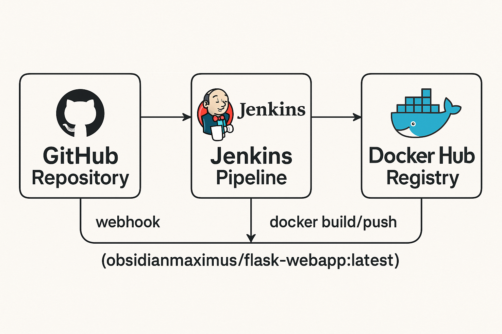

# Flask WebApp CI/CD Pipeline with Jenkins

This repository contains a sample Flask web application set up for automated CI/CD using Jenkins and Docker.  
Push events from GitHub trigger Jenkins builds via webhooks, ensuring the Docker image is always up-to-date and available on Docker Hub.

## Features

- **Automatic Build & Deploy:** GitHub webhooks trigger Jenkins to build and push the Docker image.
- **Continuous Integration:** Every commit is automatically tested and built.
- **Dockerized:** The app is packaged as a Docker image for consistent deployment.
- **Public Docker Image:** [obsidianmaximus/flask-webapp on Docker Hub](https://hub.docker.com/r/obsidianmaximus/flask-webapp)

## Quick Start

1. **Clone this repo:**
   ```bash
   git clone https://github.com/ObsidianMaximus/flask-webapp-jenkins.git
   ```

2. **Set up Jenkins:**
   - Configure a Jenkins pipeline using the `Jenkinsfile` in this repo.
   - Set up a webhook in your GitHub repository to notify Jenkins on push events.

3. **Build & Run Locally:**
   ```bash
   docker pull obsidianmaximus/flask-webapp:latest
   docker run -p 80:8080 obsidianmaximus/flask-webapp:latest
   ```

## How it Works

- When you push to this repository, GitHub sends a notification (webhook) to Jenkins.
- Jenkins executes the pipeline:
  - Builds the Docker image.
  - Pushes the image to Docker Hub: [`obsidianmaximus/flask-webapp`](https://hub.docker.com/r/obsidianmaximus/flask-webapp).
 


